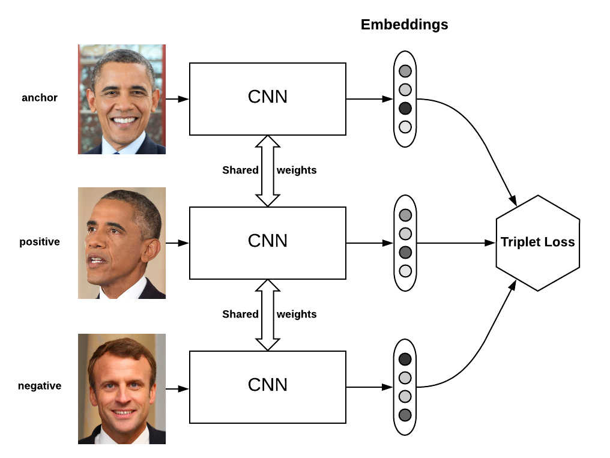
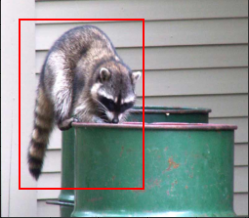
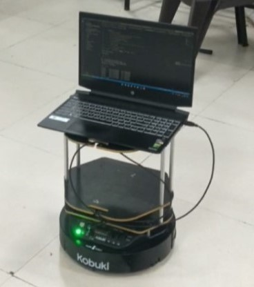

# Projects

Explore my projects below.

Want to see more? Head over to my [{fab}`github` GitHub profile](https://github.com/ABD-01) for more comprehensive look.

<style>
    .one {
      /* width: 160px; */
      /* height: 160px; */
      position: relative;
    }

    .two {
      width: 100%;
      height: 100%;
      position: absolute;
      transition: opacity .2s ease-in-out;
      -moz-transition: opacity .2s ease-in-out;
      -webkit-transition: opacity .2s ease-in-out;
    }

    .fade {
      transition: opacity .2s ease-in-out;
      -moz-transition: opacity .2s ease-in-out;
      -webkit-transition: opacity .2s ease-in-out;
    }

    .self-name {
      font-weight: bold;
      text-decoration: underline;
    }

</style>

`````{grid}
:class-container: sd-shadow-lg

````{grid-item}
:columns: 3
:class: sd-align-major-center

```{image} _static/images/cvp-removebg.png

```

````

````{grid-item}
:columns: 9

### [Connected Vehicle Protocol Server](https://abd-01.github.io/Flask-Protobuf/)
[project page](https://abd-01.github.io/Flask-Protobuf/) | [code](https://github.com/ABD-01/Flask-Protobuf)

The CVP Proto Server is a Flask-based application designed for handling MQTT communication with protobuf-encoded telemetry messages for connected vehicles. It features a user-friendly web interface with real-time updates via Socket.IO, and also includes a Command Line Interface (CLI) for direct command-response operations.
````

`````

<!-- 
`````{grid}
:class-container: sd-shadow-lg

````{grid-item}
:columns: 3
:class: one
<div class="two sd-row" id='hello'>
<video  width=100% height=100% muted autoplay loop><source src="images/ivpreds.mp4" type="video/mp4">Your browser does not support the video tag.</video>
</div>

````

````{grid-item}
:columns: 9
### Face Unlock

Muhammed Abdullah, Khurshed Fitter, Rishika Bhagwatkar
project page | pdf | code

This project implemented Triplet Network and FaceNet algorithms from scratch with ResNet as the backbone architecture for face recognition. It was developed at IvLabs for one-shot and few-shot learning on different datasets and with the goal of deploying it as a face recognition-based door lock system.
````

<script type="text/javascript">
    function hello_start() {
        document.getElementById('hello').style.opacity = "1";
    }
    function hello_stop() {
        document.getElementById('hello').style.opacity = "0";
    }
    hello_stop()
</script>

````` 
-->


`````{grid}
:class-container: sd-shadow-lg

````{grid-item}
:columns: 3
:class: sd-align-major-center

```{image} images/Arch.png

```

````

````{grid-item}
:columns: 9

### [Open-Set Multi-Source Multi-Target Domain Adaptation](https://ivlabs.github.io/os-nsmt/)
[Rohit Lal](http://rohitlal.net/), [Arihant Gaur](https://gaurarihant.github.io/), [Aadhithya Iyer](https://aadhithya14.github.io/), [Muhammed Abdullah Shaikh]{.self-name}, [Ritik Agrawal](https://www.linkedin.com/in/ritik-agrawal-6b7718189/), [Shital Chiddarwar](https://mec.vnit.ac.in/people/sschiddarwar/)\
*Pre-Registration Workshop, NeurIPS, 2021* \
[project page](https://ivlabs.github.io/os-nsmt/) | [arXiv](https://arxiv.org/abs/2302.00995) | [video](https://youtu.be/dflYL6WBZI4) | [code](https://github.com/IvLabs/os-nsmt)

This work introduced a new setting for unsupervised domain adaptation and utilized a prototypical network to create domain embeddings. We used the Local Outlier Factor (LOF) to pseudo-label unknown classes, and used graph neural networks with attentional aggregation for the adaptation stage.
````

`````

<table style="width:100%;border:0px;border-spacing:0px;border-collapse:separate;margin-right:auto;margin-left:auto;"><tbody>

<!-- Face Unlock -->
<tr onmouseout="face_stop()" onmouseover="face_start()" class="sd-shadow-lg">
<td style="padding:20px;width:25%;vertical-align:middle">
    <div class="one">
    <div class="two" id='face_image'><video  width=100% height=100% muted autoplay loop>
    <source src="images/ivpreds.mp4" type="video/mp4">
    Your browser does not support the video tag.
    </video></div>
    
    </div>
<script type="text/javascript">
    function face_start() {
        document.getElementById('face_image').style.opacity = "1";
        var twoElement = document.getElementById('face_image');
        twoElement.style.opacity = "1";
        twoElement.nextElementSibling.style.opacity = "0";
    }
    function face_stop() {
        var twoElement = document.getElementById('face_image');
        twoElement.style.opacity = "0";
        twoElement.nextElementSibling.style.opacity = "1";
    }
    face_stop()
</script>
</td>
<td style="padding:20px;width:75%;vertical-align:middle">
    <a href="https://openreview.net/forum?id=AmPeAFzU3a4">
    <h3>Face Unlock</h3>
    </a>
    <strong style="text-decoration: underline;">Muhammed Abdullah</strong>,
    <a href="https://sites.google.com/view/kpfitter">Khurshed Fitter</a>,
    <a href="https://www.linkedin.com/in/rishika-bhagwatkar-01069518b/">Rishika Bhagwatkar</a>
    <br>
    <a href="https://wandb.ai/abd1/Face-Unlock/reports/Face-Unlock--VmlldzoxMzEyNjQ4">project page</a>
    |
    <a href="https://drive.google.com/file/d/1dUgs0scuxf6f7TJywUj7D6P3bfmro6eJ/view?usp=sharing">pdf</a>
    |
    <a href="https://github.com/IvLabs/Face-Unlock">code</a>
    <p></p>
    <p>
    This project implemented Triplet Network and FaceNet algorithms from scratch with ResNet as the backbone architecture for face recognition. It was developed at IvLabs for one-shot and few-shot learning on different datasets and with the goal of deploying it as a face recognition-based door lock system.
    </p>
</td>
</tr>						

<!-- Object Detection -->
<tr onmouseout="nlt_stop()" onmouseover="nlt_start()" class="sd-shadow-lg">
<td style="padding:20px;width:25%;vertical-align:middle">
    <div class="one">
    <div class="two" id='nlt_image'><video  width=100% height=100% muted autoplay loop>
    <source src="images/Racoon.m4v" type="video/mp4">
    Your browser does not support the video tag.
    </video></div>
    
    </div>
    <script type="text/javascript">
    function nlt_start() {
        var twoElement = document.getElementById('nlt_image');
        twoElement.style.opacity = "1";
        twoElement.nextElementSibling.style.opacity = "0";
    }
    function nlt_stop() {
        var twoElement = document.getElementById('nlt_image');
        twoElement.style.opacity = "0";
        twoElement.nextElementSibling.style.opacity = "1";
    }
    nlt_stop()
</script>
</td>
<td style="padding:20px;width:75%;vertical-align:middle">
    <a href="https://github.com/IvLabs/Object-Detection">
    <h3>Object Detection</h3>
    </a>
    <a href="https://www.linkedin.com/in/harsh-sharma-018206233/">Harsh Sharma</a>,
    <a href="https://www.linkedin.com/in/rajashree-tekaday-261582205/">Rajashree Tekaday</a>,
    <strong style="text-decoration:underline;"> Muhammed Abdullah</strong>
    <br>
    <a href="https://github.com/IvLabs/Object-Detection">code</a>
    <p></p>
    <p>This project is an implementation of a sliding window technique with a two-stage detector, enhanced with the Overfeat framework, for object detection on a Raccoon Dataset.</p>
</td>
</tr> 
        
<!-- ROS PID -->
<tr onmouseout="tb_stop()" onmouseover="tb_start()" class="sd-shadow-lg">
<td style="padding:20px;width:25%;vertical-align:middle">
    <div class="one">
    <div class="two" id='tb_image'><video  width=100% height=100% muted autoplay loop>
    <source src="images/turtlebot.m4v" type="video/mp4">
    Your browser does not support the video tag.
    </video></div>
    
    </div>
    <script type="text/javascript">
    function tb_start() {
        var twoElement = document.getElementById('tb_image');
        twoElement.style.opacity = "1";
        twoElement.nextElementSibling.style.opacity = "0";
    }
    function tb_stop() {
        var twoElement = document.getElementById('tb_image');
        twoElement.style.opacity = "0";
        twoElement.nextElementSibling.style.opacity = "1";
    }
    tb_stop()
</script>
</td>
<td style="padding:20px;width:75%;vertical-align:middle">
    <a href="https://github.com/ABD-01/ros_pid">
    <h3>PID Control and Path Planning for TurtleBot in ROS</h3>
    </a>
    <strong style="text-decoration: underline;">Muhammed Abdullah</strong>
    <br>
    <a href="https://github.com/ABD-01/ros_pid">code</a>
    <p></p>
    <p>This project involved implementing a PID controller on a TurtleBot robot to perform a Goal-to-Goal task and Path Planning task. The controller was modeled using a Hermite curve to generate a trajectory for the robot's motion from the initial to the goal pose.</p>
</td>
</tr>

</tbody></table>