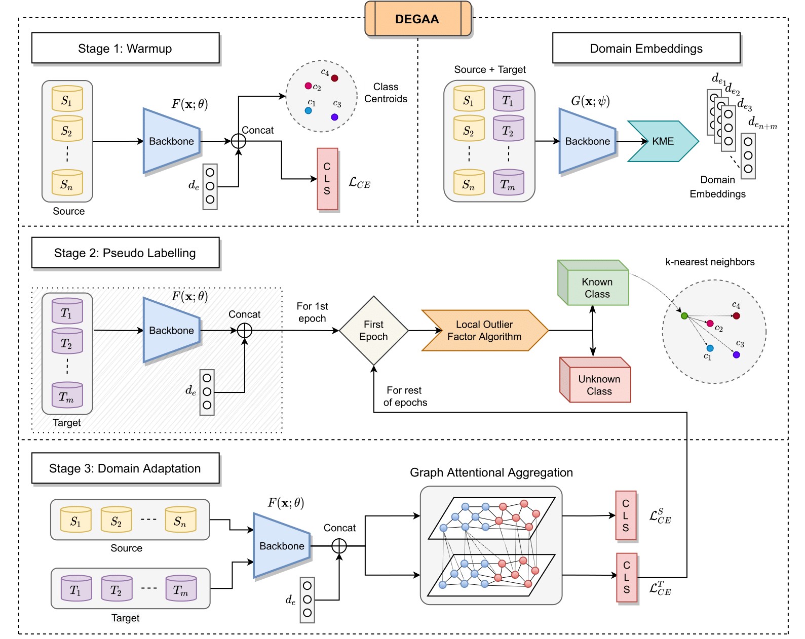

# Projects

Explore my projects below.

<table style="width:100%;border:0px;border-spacing:0px;border-collapse:separate;margin-right:auto;margin-left:auto;"><tbody>

<tr onmouseout="dreamfusion_stop()" onmouseover="dreamfusion_start()">
<td style="padding:20px;width:25%;vertical-align:middle">
    

    
    

</td>
<td style="padding:20px;width:75%;vertical-align:middle">
    <a href="https://ivlabs.github.io/os-nsmt/">
    <h3>Open-Set Multi-Source Multi-Target Domain Adaptation</h3>
    </a>
    <a href="http://rohitlal.net/">Rohit Lal</a>,
    <a href="https://gaurarihant.github.io/">Arihant Gaur</a>,
    <a href="https://aadhithya14.github.io/">Aadhithya Iyer</a>,
    <strong>Muhammed Abdullah Shaikh</strong>,
    <a href="https://www.linkedin.com/in/ritik-agrawal-6b7718189/">Ritik Agrawal</a>,
    <a href="https://mec.vnit.ac.in/people/sschiddarwar/">Shital Chiddarwar</a>
     
    <em>Pre-Registration Workshop, NeurIPS</em>, 2021 
    <!-- &nbsp <strong>(Oral Presentation)</strong> -->
     
    <a href="https://ivlabs.github.io/os-nsmt/">project page</a>
    |
    <a href="https://arxiv.org/abs/2302.00995">arXiv</a>
    |
    <a href="https://youtu.be/dflYL6WBZI4">video</a>
    |
    <a href="https://github.com/IvLabs/os-nsmt">code</a>
    

    

    This work introduced a new setting for unsupervised domain adaptation and utilized a prototypical network to create domain embeddings. We used the Local Outlier Factor (LOF) to pseudo-label unknown classes, and used graph neural networks with attentional aggregation for the adaptation stage.
    

</td>
</tr>

<!-- Face Unlock -->
<tr onmouseout="face_stop()" onmouseover="face_start()">
<td style="padding:20px;width:25%;vertical-align:middle">
    

    
<video  width=100% height=100% muted autoplay loop>
    <source src="images/ivpreds.mp4" type="video/mp4">
    Your browser does not support the video tag.
    </video>

    
    

</td>
<td style="padding:20px;width:75%;vertical-align:middle">
    <a href="https://openreview.net/forum?id=AmPeAFzU3a4">
    <h3>Face Unlock</h3>
    </a>
    <strong>Muhammed Abdullah</strong>,
    <a href="https://sites.google.com/view/kpfitter">Khurshed Fitter</a>,
    <a href="https://www.linkedin.com/in/rishika-bhagwatkar-01069518b/">Rishika Bhagwatkar</a>
     
    <a href="https://wandb.ai/abd1/Face-Unlock/reports/Face-Unlock--VmlldzoxMzEyNjQ4">project page</a>
    |
    <a href="https://drive.google.com/file/d/1dUgs0scuxf6f7TJywUj7D6P3bfmro6eJ/view?usp=sharing">pdf</a>
    |
    <a href="https://github.com/IvLabs/Face-Unlock">code</a>
    

    

    This project implemented Triplet Network and FaceNet algorithms from scratch with ResNet as the backbone architecture for face recognition. It was developed at IvLabs for one-shot and few-shot learning on different datasets and with the goal of deploying it as a face recognition-based door lock system.
    

</td>
</tr>						

<!-- Object Detection -->
<tr onmouseout="nlt_stop()" onmouseover="nlt_start()">
<td style="padding:20px;width:25%;vertical-align:middle">
    

    
<video  width=100% height=100% muted autoplay loop>
    <source src="images/Racoon.m4v" type="video/mp4">
    Your browser does not support the video tag.
    </video>

    
    

    
</td>
<td style="padding:20px;width:75%;vertical-align:middle">
    <a href="https://github.com/IvLabs/Object-Detection">
    <h3>Object Detection</h3>
    </a>
    <a href="https://www.linkedin.com/in/harsh-sharma-018206233/">Harsh Sharma</a>,
    <!-- <a href="https://www.linkedin.com/in/rajashree-tekaday-261582205/">Rajashree Tekaday</a> -->
    <strong>Muhammed Abdullah</strong>,
    <!-- <a href="http://cseweb.ucsd.edu/~ravir/">Ravi Ramamoorthi</a>, -->
    <!-- <a href="http://billf.mit.edu/">William T. Freeman</a> -->
     
    <a href="https://github.com/IvLabs/Object-Detection">code</a>
    

    
This project is an implementation of a sliding window technique with a two-stage detector, enhanced with the Overfeat framework, for object detection on a Raccoon Dataset.

</td>
</tr> 
        
<!-- ROS PID -->
<tr onmouseout="tb_stop()" onmouseover="tb_start()">
<td style="padding:20px;width:25%;vertical-align:middle">
    

    
<video  width=110% height=110% muted autoplay loop>
    <source src="images/turtlebot.m4v" type="video/mp4">
    Your browser does not support the video tag.
    </video>

    
    

    
</td>
<td style="padding:20px;width:75%;vertical-align:middle">
    <a href="https://github.com/ABD-01/ros_pid">
    <h3>PID Control and Path Planning for TurtleBot in ROS</h3>
    </a>
    <strong>Muhammed Abdullah</strong>
     
    <a href="https://github.com/ABD-01/ros_pid">code</a>
    

    
This project involved implementing a PID controller on a TurtleBot robot to perform a Goal-to-Goal task and Path Planning task. The controller was modeled using a Hermite curve to generate a trajectory for the robot's motion from the initial to the goal pose.

</td>
</tr>

</tbody></table>